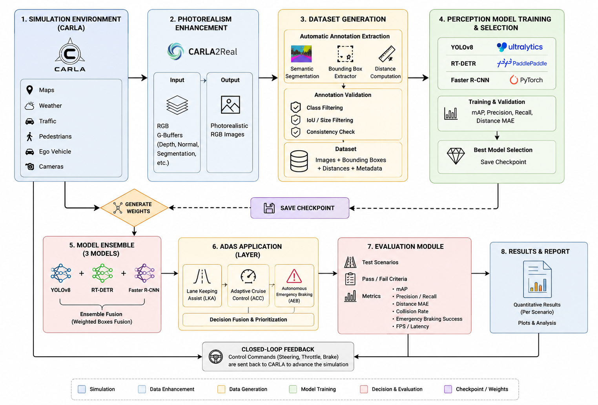
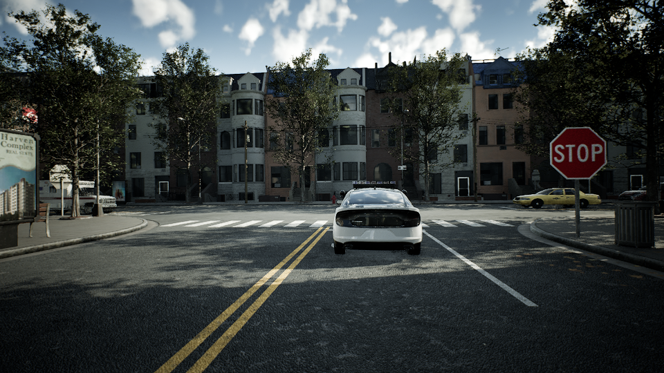
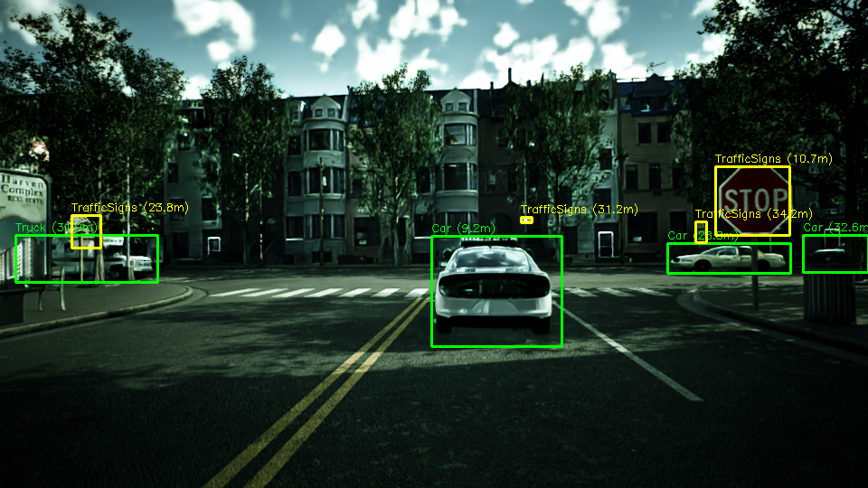

# Carla2Real-ADAS: A Simulation-to-Real Transfer Framework for Vision-Based ADAS

**Authors:** Ahmed M. Abbas, Mohamed Adel  
**Affiliation:** Information Technology and Computer Science School, Nile University, Giza, Egypt

This project was originated to show the code and expirements done for the paper [Carla2Real-ADAS: A Simulation-to-Real Transfer Framework for Vision-Based ADAS Using Synthetic Data and Object Detection](https://www.overleaf.com/project/6a33bf0a6f60235b4edfefdd) *Link to be Updated* 

## Introduction

Advanced Driver Assistance Systems (ADAS) heavily rely on data-driven perception models (e.g., object detection). However, collecting and annotating real-world data is expensive, time-consuming, and potentially dangerous in edge-case scenarios. 

**Carla2Real-ADAS** proposes an end-to-end Simulation-to-Real (Sim2Real) pipeline designed specifically for the development and validation of camera-based ADAS using the CARLA simulator. 

This framework integrates:
1. **Synthetic Data Generation:** Generates annotated datasets with object bounding boxes and relative distance estimations (in meters) within CARLA.
2. **Photorealistic Enhancement:** Utilizes [CARLA2Real](https://github.com/stefanos50/CARLA2Real) to enhance CARLA outputs, bridging the Sim2Real appearance gap.
3. **Perception Model Training:** Trains state-of-the-art object detection models (YOLOv8, RT-DETR, Faster R-CNN) on the enhanced synthetic data.
4. **Closed-Loop ADAS Module:** Re-integrates generalized models into the CARLA simulation to perform real-time perception. Detected objects and distances are fed to an ADAS decision module to control the ego vehicle dynamically (e.g., steering, emergency braking).

## Collected Dataset Sample

The following comparison highlights the original CARLA scene alongside the enhanced output generated by the pipeline:

<table>
  <tr>
    <td align="center"><b>Original CARLA image</b></td>
    <td align="center"><b>Enhanced image with bounding boxes and distance annotations</b></td>
  </tr>
  <tr>
    <td></td>
    <td></td>
  </tr>
</table>

## Repository Structure

- `carla_unreal_engine_5/`: Contains Python scripts for dataset generation, G-buffer extraction, preprocessing, and model inference inside CARLA (built from source in Unreal Engine 5).
- `Dataset/`: Directory structure housing extracted data such as `BoundingBoxes`, `EPE` buffers, raw `Frames`, `Semantic` segmentations, and final `VisulOutput`. *Not uploaded to this repository*
- `AWS_Private_EC2.sh`: A helper bash script used to spin up an AWS EC2 instance with AWS SSM port forwarding for running the simulator remotely.
- `full_pipeline.sh`: A helper bash script used to trigger the whole pipeline assuming the database is already collected. it doesn't require CARLA to run or a graphical connection.

## Getting Started

Please refer to the internal README at [`carla_unreal_engine_5/README.md`](carla_unreal_engine_5/README.md) for detailed instructions on launching the simulator, data generation, preprocessing, running the photorealistic inference, and visualizing the outputs.

## License

See the `LICENSE` file for further information.
